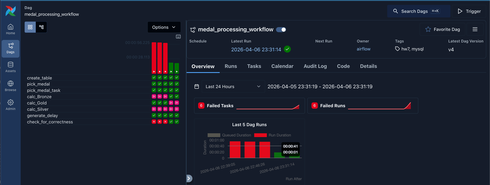
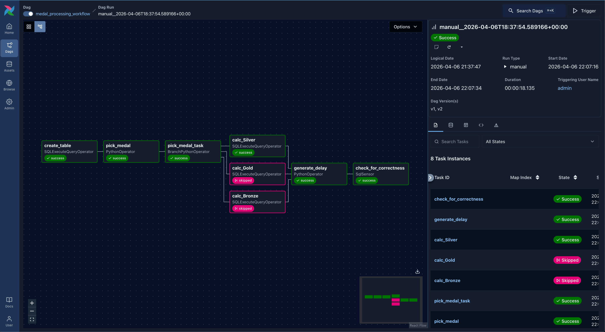
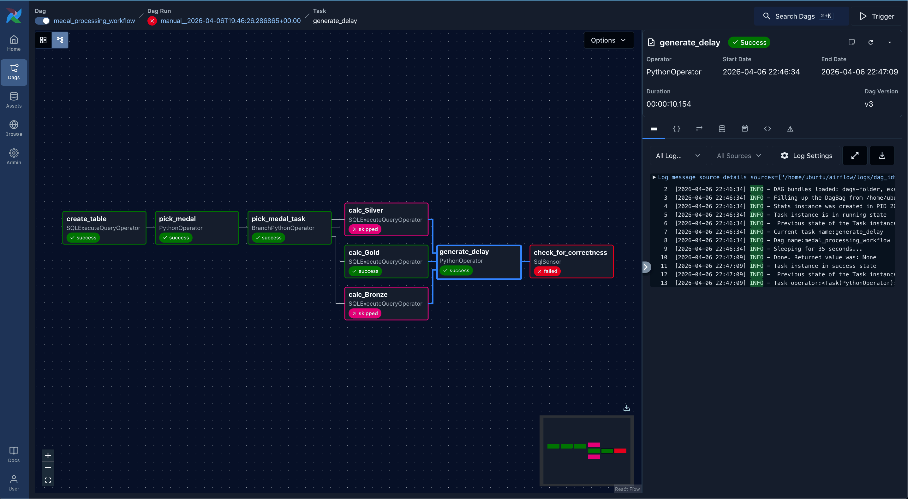
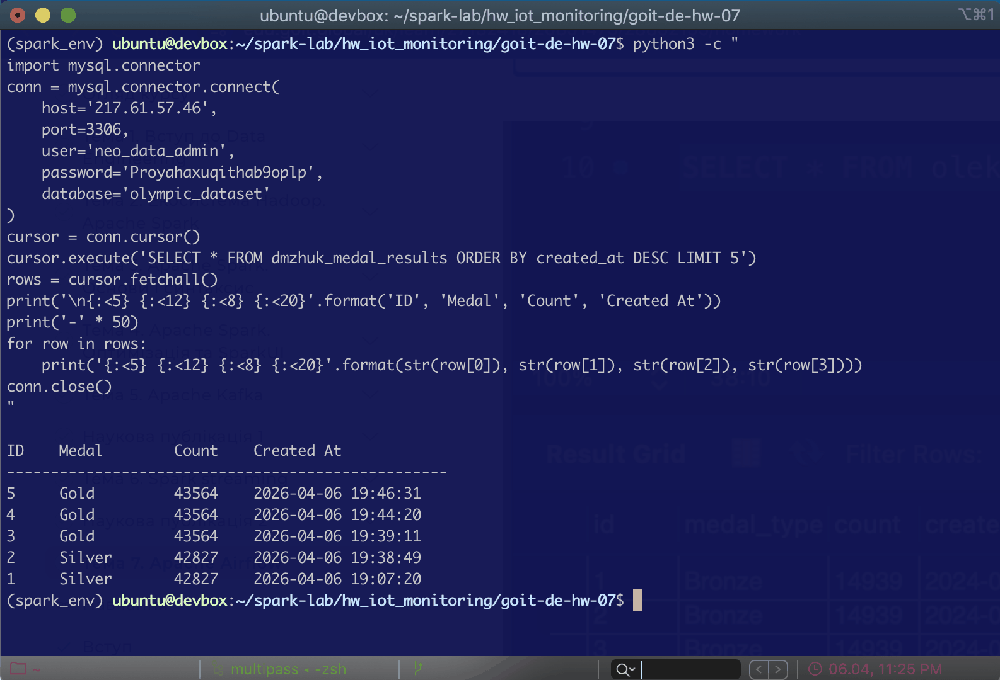

 # Apache Airflow: Medal Processing Pipeline (HW-07)

Цей проєкт реалізує автоматизований робочий процес (DAG) в Apache Airflow для обробки даних олімпійських медалей із бази даних MySQL, включаючи логіку розгалуження, використання сенсорів та керування затримками.

## Функціонал DAG

Робочий процес складається з таких етапів:
1. **Створення таблиці**: автоматичне створення `dmzhuk_medal_results` у схемі `olympic_dataset`, якщо вона ще не існує.
2. **Розгалуження (Branching)**: випадковий вибір типу медалі (`Bronze`, `Silver`, `Gold`) за допомогою BranchPythonOperator.
3. **Обчислення**: використання SQLExecuteQueryOperator для підрахунку медалей та запису результату.
4. **Затримка**: імітація затримки (10-35 сек) з використанням TriggerRule.ONE_SUCCESS.
5. **Валідація (Sensor)**: використання SqlSensor для перевірки "свіжості" даних (вікно 30 секунд).

## Технологічний стек
* **Python 3.12**
* **Apache Airflow 3.1.8** (з провайдером `mysql`)
* **MySQL** (зовнішній хост `217.61.57.46`)
* **Multipass/Ubuntu** (для розгортання Devbox)

## Візуалізація та результати

### Структура DAG (Graph View)



Нижче наведено граф виконання із успішним розгалуженням:


### Тестування затримки та помилка сенсора
При затримці >30 секунд сенсор `check_for_correctness` падає з таймаутом, що підтверджує коректність валідації:


### Результати в базі даних (MySQL)
Записи в таблиці `olympic_dataset.dm_zhuk_medal_results` після кількох запусків:


## Інструкція з розгортання (Native Ubuntu)

* проєкт налаштовано для роботи в нативному оточенні Ubuntu з Python 3.12+;
* проєкт адаптовано під архітектуру Airflow 3.x, включаючи підтримку часових поясів (UTC) та новий механізм імпорту TriggerRule через airflow.task.trigger_rule.

1. **Запуск Airflow**:
   Віртуальне середовище активоване -> запустіть сервіси:
   ```bash
   source ~/spark_env/bin/activate
   airflow standalone
   ```
Доступ до інтерфейсу:
Airflow UI буде доступний за адресою http://<IP_вашого_devbox>:8080.